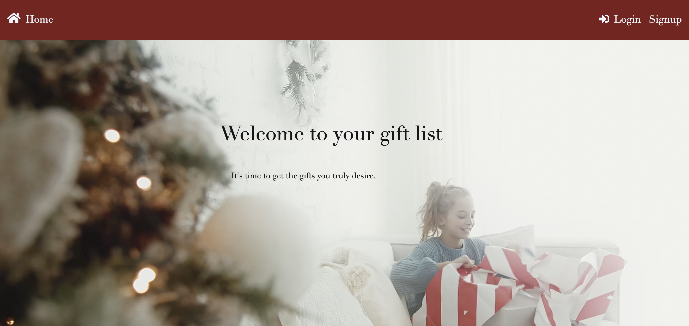
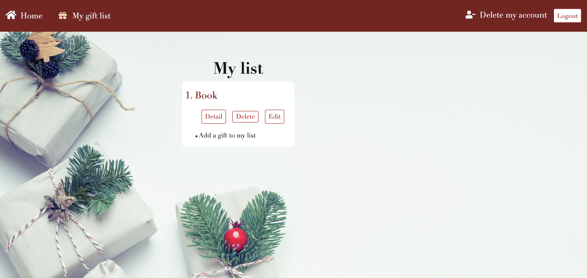
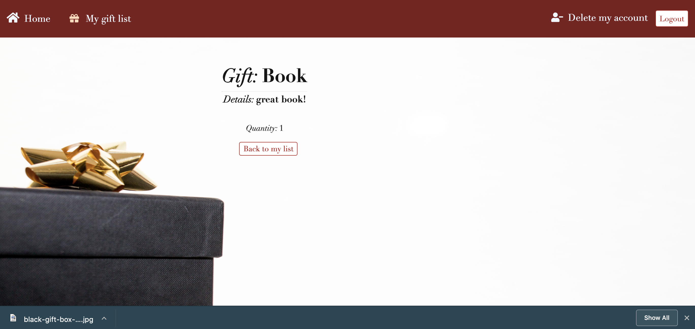
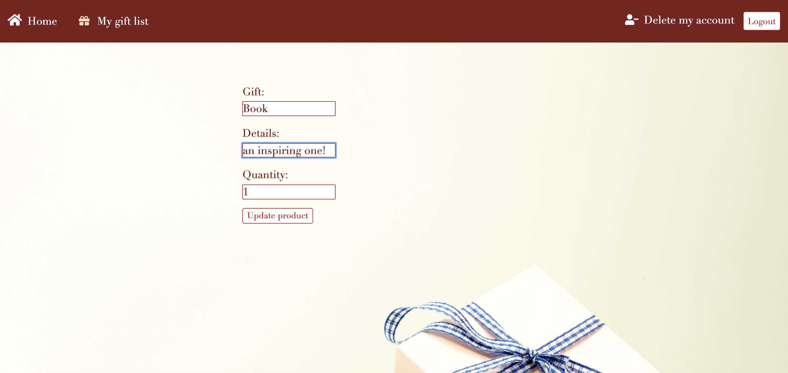
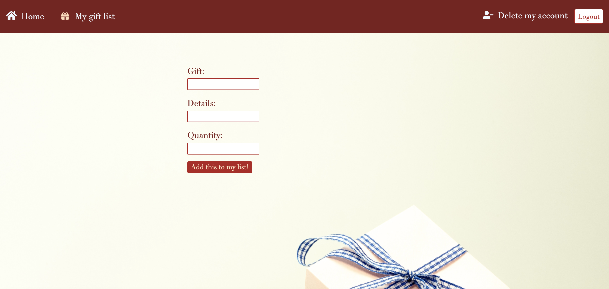

# Gift app - Project

## Project concept

- Creating a list of desired gifts (example: for Christmas, birthdays).

To do so: 
- Creating a new account (with an email system),
- Logging in to keep track of the list (using sessions with cookies),
- Editing, deleting the list.

## Technologies used

- JavaScript
- NodeJS, ExpressJS
- HTML
- CSS & Sass
- mySQL 
- Sequelize
- Sendgrid for automatic emails

### Project examples: 

- Example // The landing page: 

- Example // Signing up or logging in:

- Example // Getting the gifts list:  

- Example // Having the detail of one list: 

- Example // Editing a gift: 

- Example // Adding a gift: 

...

#### Thank you for reading!

Justine.
